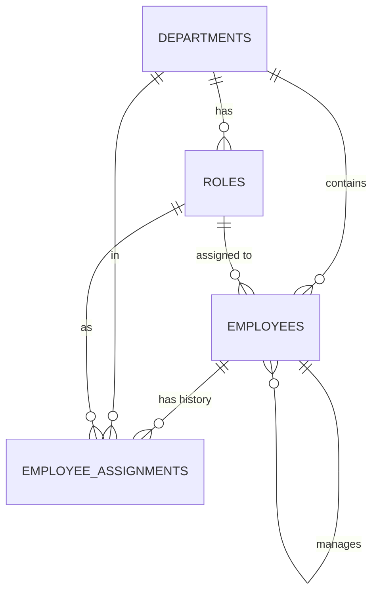

```mermaid
erDiagram
    DEPARTMENTS ||--o{ ROLES : has
    DEPARTMENTS ||--o{ EMPLOYEES : contains
    ROLES ||--o{ EMPLOYEES : "assigned to"
    EMPLOYEES ||--o{ EMPLOYEES : manages
    EMPLOYEES ||--o{ EMPLOYEE_ASSIGNMENTS : "has history"
    DEPARTMENTS ||--o{ EMPLOYEE_ASSIGNMENTS : in
    ROLES ||--o{ EMPLOYEE_ASSIGNMENTS : as
```